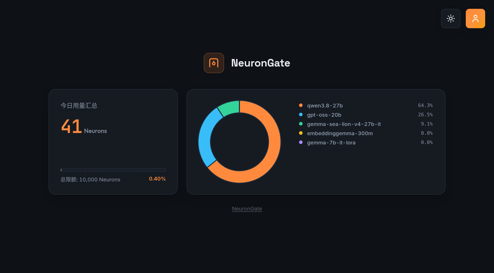
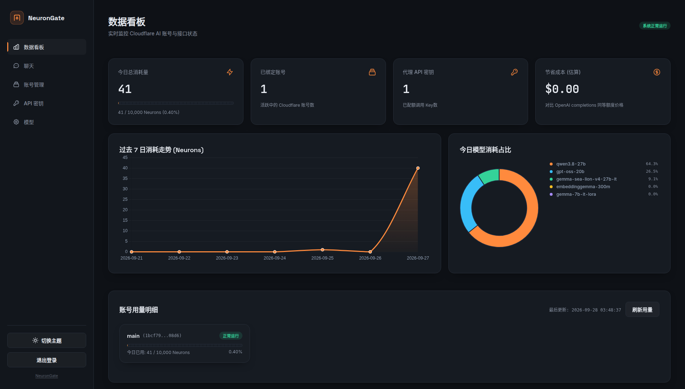
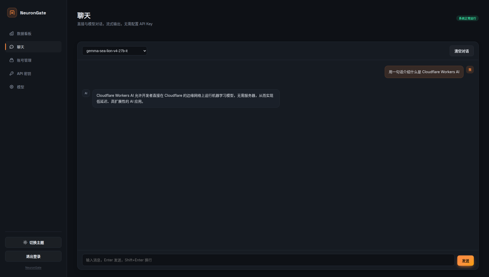
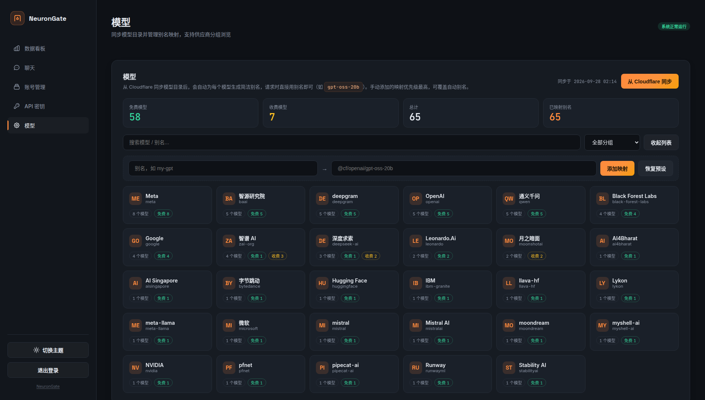

# NeuronGate

把 Cloudflare Workers AI 变成 OpenAI 兼容接口，自带可视化控制台、内置聊天与模型分组鉴权。

支持两种部署方式：**Cloudflare Workers / Pages**（原生），或 **Docker**（自托管，适合国内网络环境）。

#### 公开首页


#### 数据看板


#### 内置聊天


#### 模型目录（按供应商分组）


## 🚀 它能干什么

- **OpenAI 兼容**：把 CF Workers AI 模型转成 `/v1/chat/completions`，Cursor、LobeChat、NextChat、Cherry Studio 等客户端直接接入
- **多模态**：同时支持 `/v1/embeddings` 向量嵌入与 Anthropic `/v1/messages`
- **负载均衡**：绑定多个 CF 账号，请求随机分配；单账号额度耗尽或故障自动切换下一个
- **内置聊天**：控制台内直接对话，流式输出，消息可复制 / 重新生成 / 编辑重发 / 删除
- **模型目录同步**：一键从 CF 拉取全部可用模型，按**免费 / 收费**自动分组，并按**供应商**分组浏览（含中文能力与简介）
- **自动映射**：同步时自动为每个模型生成简洁别名（如 `gpt-oss-20b`），请求时直接用别名
- **分组鉴权**：API 密钥可指定「仅免费 / 仅收费 / 全部」，越权调用直接 403
- **用量看板**：账号卡片内联展示今日 Neuron 余量与状态，支持多账号汇总

## ⚡ 部署

### 🐳 Docker 部署（推荐自托管）

```bash
git clone https://github.com/salem-2007/NeuronGate.git
cd NeuronGate
ADMIN_PASSWORD='你的管理员密码' docker compose up -d --build
```

访问 `http://localhost:8080`，用管理员密码登录即可。

> WSL2 / 国内网络提示：到 Cloudflare 的直连常被阻断，`docker-compose.yml` 已默认使用 `network_mode: host`，
> 容器复用宿主机的出网路径。若宿主机本身需要代理才能访问 CF，请确保宿主机代理常开。

### 📦 Cloudflare Pages 部署

1. 把 `_worker.js` 拖到 Cloudflare Pages 上传
2. 绑定 KV：变量名填 `KV`，选一个你创建的 KV 命名空间
3. 添加环境变量 `ADMIN_PASSWORD`（必设，否则服务拒绝访问）
4. 重新部署让绑定生效

### 🔧 Cloudflare Workers 部署

```bash
npm install -g wrangler
wrangler login
wrangler deploy
```

`wrangler.toml` 里绑定 KV：

```toml
[[kv_namespaces]]
binding = "KV"
id = "你的KV命名空间ID"
```

## 📋 使用步骤

1. 打开部署地址，输入管理员密码登录
2. 在「账号管理」添加 CF 账号（Account ID + API Token）。Token 在 [Cloudflare Dashboard](https://dash.cloudflare.com/) → My Profile → API Tokens → Workers AI 模板生成
3. 到「模型」页点「从 Cloudflare 同步」，自动拉取模型目录并生成别名
4. 在「API 密钥」生成调用密钥（`sk-wa-xxx`），可按需选择可调用的模型分组
5. 客户端配置 Base URL 为 `https://你的域名/v1`，填入密钥即可

## 🔑 模型与映射

同步后，面板里可直接用简洁别名调用；也支持手动添加别名映射（优先级最高）：

| 请求名 | CF 实际模型 |
|--------|------------|
| `glm-5.2` | `@cf/zai-org/glm-5.2` |
| `kimi-k2.7-code` | `@cf/moonshotai/kimi-k2.7-code` |
| `gpt-oss-20b` | `@cf/openai/gpt-oss-20b` |
| `bge-m3` | `@cf/baai/bge-m3` |

映射优先级：**内置默认 < 自动同步 < 用户自定义**。直接传 `@cf/xxx` 开头的模型名会跳过映射透传。

免费 / 收费的判定依据是 CF 模型属性 `require_workers_paid`，以实时同步的目录为准。

## 🤝 致谢

- 基于 [WorkersAI2API](https://github.com/cmliussss2024/WorkersAI2API) 二次开发
- 特别感谢 **[Cloudflare](https://www.cloudflare.com/)** 提供强大且免费的 Workers AI 服务和 Pages 托管平台
